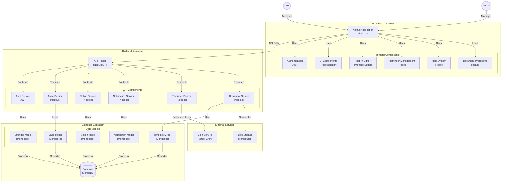

# <p align="center">Court⚖️Jester</p>    

<p align="center">
  <a href="https://nextjs.org/">
    
  </a>
  <a href="https://reactjs.org/">
    
  </a>
  <a href="https://tailwindcss.com/">
    
  </a>
  <a href="https://www.framer.com/motion/">
    
  </a>
</p>

<p align="center">
  <a href="https://nodejs.org/">
    
  </a>
  <a href="https://vercel.com/">
    
  </a>
  <a href="https://www.mongodb.com/">
    
  </a>
</p>


Court Jester is a modern, full-stack legal management platform that streamlines offender case management, notifications, motions, and more. Built with cutting-edge technologies, Court Jester delivers a seamless experience for legal teams and offenders alike.

---


---

## Table of Contents

* [Overview](#overview)
* [Features](#features)
* [Tech Stack](#tech-stack)
* [Architecture](#architecture)
* [Getting Started](#getting-started)
* [API Documentation](#api-documentation)
* [Contributing](#contributing)
* [License](#license)
* [Contact](#contact)

---

## Overview

Court Jester automates legal workflows—from managing offender profiles and cases to handling notifications and motion submissions. With a modular, scalable architecture, this project is built for performance and maintainability using Next.js, React, TypeScript, and Vercel.

---

## Features

* <i class="fa fa-tachometer" aria-hidden="true"></i> **Admin Dashboard**: Manage notifications, offenders, cases, motions, and reminders with a sleek, user-friendly interface.
* <i class="fa fa-user-circle" aria-hidden="true"></i> **Offender Portal**: Secure access for offenders to view their profiles, cases, and receive timely notifications.
* <i class="fa fa-plug" aria-hidden="true"></i> **Dynamic API Endpoints**: RESTful endpoints covering all CRUD operations for legal entities such as cases, motions, and notifications.
* <i class="fa fa-clock-o" aria-hidden="true"></i> **Real-time Data**: Utilize Next.js server actions and API routes for seamless, real-time updates.
* <i class="fa fa-shield" aria-hidden="true"></i> **Comprehensive Type System**: Leverage TypeScript to ensure robust type safety across all modules—from data models to component props.
* <i class="fa fa-magic" aria-hidden="true"></i> **Modern UX**: Responsive design, intuitive interactions, and smooth animations (powered by Framer Motion) make for an outstanding user experience.

---

<p align="center" style="font-size: 100px;">🃏</p>


---

## Tech Stack

* 🚀 **Frontend**: Next.js 15, React 19, Tailwind CSS, Framer Motion
* 🔧 **Backend**: Node.js, Next.js API routes, Vercel Blob Storage
* 🗄️ **Database**: MongoDB with a well-defined TypeScript model layer (Offender, Case, Motion, Notification, Reminder)
* 🔐 **Authentication**: Clerk for secure, reliable session management
* ☁️ **Deployment**: Vercel for effortless scaling and deployments

---

## Architecture

Court Jester embraces a modular, hybrid architecture with a clear separation between client and server logic:

* <i class="fa fa-user-circle" aria-hidden="true"></i> **Admin & Offender Dashboards**: Two distinct portals designed for administrators and offenders, respectively, each with its own set of tailored features.
* <i class="fa fa-plug" aria-hidden="true"></i> **API Endpoints**: A rich set of RESTful endpoints to handle operations for offenders, cases, motions, notifications, and reminders. (See the API Documentation for details.)
* <i class="fa fa-file-code-o" aria-hidden="true"></i> **Type-Driven Development**: An extensive TypeScript type system ensures consistency and type safety across the application, as detailed in the comprehensive type system documentation.
* <i class="fa fa-cogs" aria-hidden="true"></i> **Modern Development Practices**: Optimized for CI/CD workflows, efficient API performance, and secure authentication.

--- 

#### <p align="center">Code<i class="fa fa-balance-scale" aria-hidden="true"></i>Visualization</p>    



---

## Getting Started

### Prerequisites

- **Node.js**: (>= 14.x)
- **Package Manager**: npm or yarn
- **Database**: MongoDB instance
- **Deployment**: Vercel account

### Installation

1. **Clone the repository:**

   ```bash
   git clone https://github.com/your-username/court-jester.git
   cd court-jester
   ```

2. **Install dependencies:**

   ```bash
   npm install
   # or
   yarn install
   ```

3. **Copy and configure environment variables:**

   ```bash
   cp .env.example .env
   ```

### Running Locally

Start the development server:

```bash
npm run dev
# or
yarn dev
```

Open [http://localhost:3000](http://localhost:3000) to explore the app.

---

## API Documentation

Court Jester includes a robust API for managing legal workflows. The API provides endpoints for:

- **Offenders**: Listing, retrieving, updating, and deleting offender profiles.
- **Cases**: Managing legal cases including filing, updating, and deletion.
- **Notifications**: Creating, listing, updating, and deleting notifications.
- **Motions & Reminders**: Handling motions and reminders with support for document uploads and automated processing.

For full API details, please see the [API Documentation](#api-documentation).

---

## Contributing

Contributions are welcome! Please follow these steps:

1. Fork the repository.
2. Create a new branch for your feature or bug fix.
3. Commit your changes with clear, descriptive messages.
4. Open a pull request with details on your changes.

---

## License

This project is licensed under the MIT License.

---

## Contact

For questions, feedback, or support, please open an issue on GitHub.

---

<p align="center">Made with ❤️ by the Court Jester Team</p>
